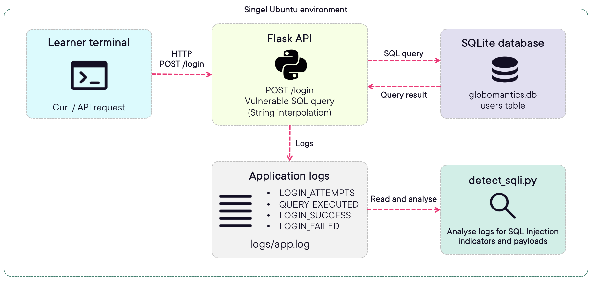

# Architecture

## Environment Overview

This lab uses a single Ubuntu environment containing a vulnerable Flask application and supporting scripts used to demonstrate SQL Injection exploitation, detection, and remediation.

Environment type:

```text
Single Ubuntu 22.04 instance
```

Components:

1. Vulnerable Flask API
2. SQLite database
3. Application logs
4. SQL Injection detection script

---

# Lab Environment Architecture
<p align="center">
  
</p>

---

# Authentication Flow

Normal authentication:

```text
Learner
   ↓
POST /login
   ↓
Flask API
   ↓
SQLite query
   ↓
Authentication response
```

---

# SQL Injection Detection Flow

Attack:

```text
SQL Injection payload
      ↓
Application processes request
      ↓
Payload written to logs
      ↓
detect_sqli.py identifies suspicious patterns
```

---

# Security Concepts Demonstrated

This lab demonstrates:

✓ SQL Injection exploitation

✓ Log analysis

✓ Secure coding practices

✓ Parameterized queries

✓ Vulnerability remediation

✓ Verification of mitigation effectiveness

---

# Estimated Duration

10–15 minutes